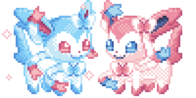

  

#

Me chamo Alanis Ortolani, tenho 20 anos e sou estudante de Análise e Desenvolvimento de Sistemas no IFSP. Gosto muito de tecnologia e sou muito interessada na área de Dados, Automações e Inteligência Artificial.
 
#

<h3 align="left">Contatos!</h3>

<h3 align="left">Tecnologias Favoritas</h3>

  
          
          

 
 

<h3 align="left">GitHub Status</h3>

  

 
  

  

